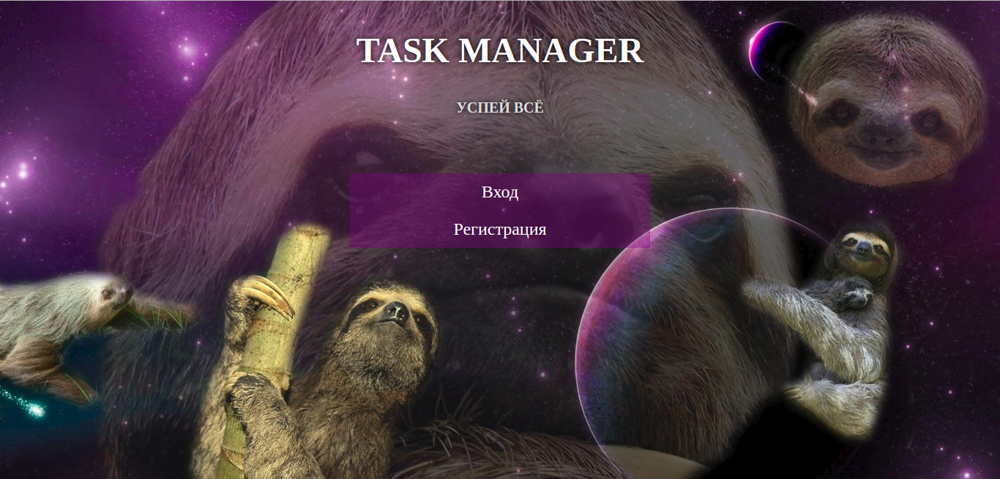
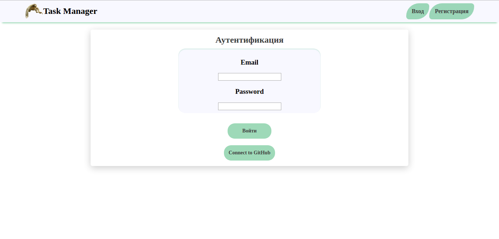
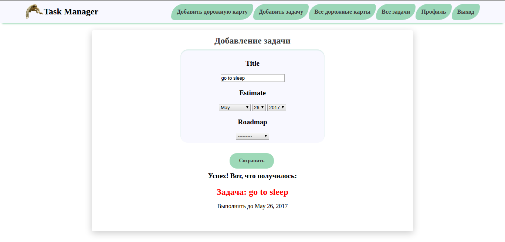
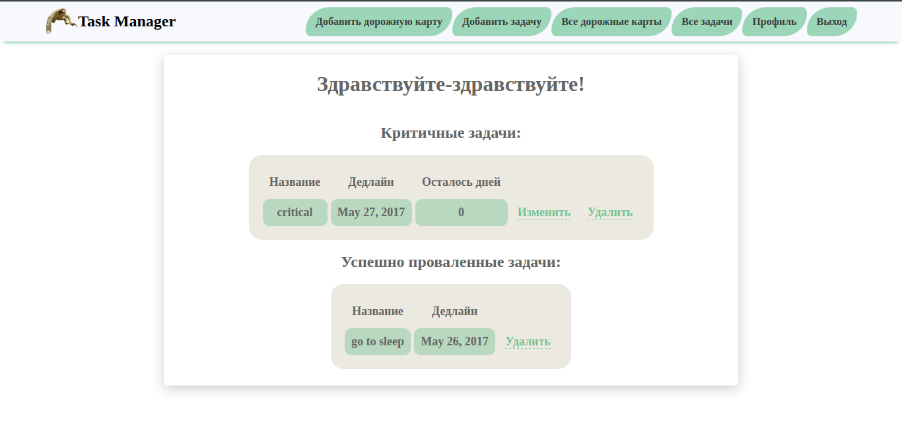

# TaskManager
Task manager web app for [TechnoAtom](https://atom.mail.ru/) Python course (spring 2017) 

Main contributors:
- [Roman Yakubovich](https://github.com/robbydrive)
- [Ekaterina Nikiforova](https://github.com/jpgr9)

What was used:
- Python 3.6
- Django 1.10
- Django Social Auth
- MySQL Database 5.7
- Pylint 1.7
- Travis CI

### Screenshots

